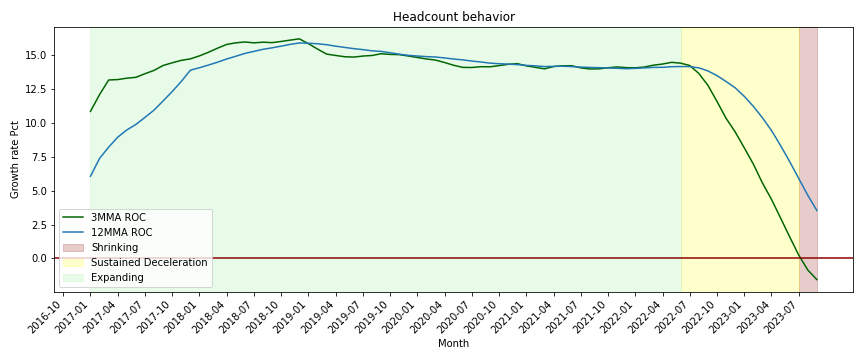
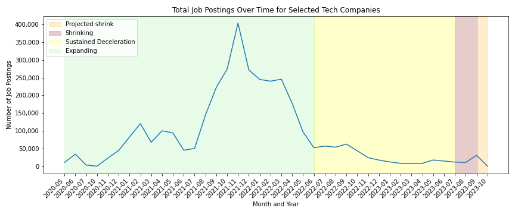
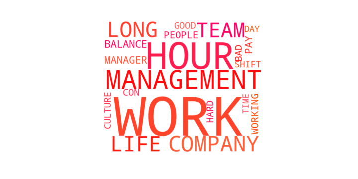
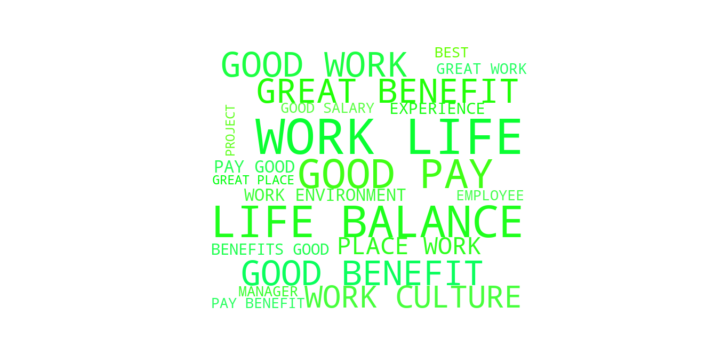

<h3 align="Left">
    
     
</h3>

# Tech Industry Trends: Navigating Challenges and Shifting Dynamics

**Key Findings:**
- Analysis focused on major tech companies like Apple, Amazon, Netflix, and others.
- Utilized 3 and 12 months rates of change for moving averages to eliminate seasonality.
- Job postings peaked in 2021, followed by a sharp decline, signaling a conservative hiring approach.

In the ever-evolving landscape of the tech industry, our recent analysis reveals intriguing insights into the workforce dynamics and sentiments within major players such as Apple, Amazon, and Netflix.

**Sustained Positive Behavior in Rates of Change**

*How has the performance trend of major tech companies evolved over the years?*

Our exploration of 3 and 12 months rates of change for moving averages showed a sustained positive trend from April 2017 to July 2022, around 10% and 15%. However, a rapid decline in July 2022 raised intriguing questions, with the 3-month ROC breaking the negative threshold in July 2023.

**Job Postings: A Sharp Decline**

*What impact have recent events had on the hiring landscape of major tech players?*

Analyzing job postings from 2020 to 2023 uncovered a significant peak in September and October 2021, with over 400,000 positions available. However, a dramatic decrease ensued, with less than half of the maximum postings within a year. September 2023 witnessed an aggressive decline, suggesting a prolonged conservative hiring approach.

<h3 align="Left">
    
     
</h3>

<h3 align="Left">
    
     
</h3>

**Employee Sentiment Analysis**

*How have employees responded to massive layoffs within the tech industry?*

Two wordmaps, one reflecting negative sentiments and the other positive sentiments, were created to gauge employee opinions post-massive layoffs in 2023. Negative sentiments included words like work, management, long, balance, while positive sentiments highlighted expressions such as good work, best, great work, experience, work-life balance.

<h3 align="Left">
    
     
</h3>

<h3 align="left">
    
     
</h3>

**Business Outlook Distribution (2023 vs. 2018)**

*What is the current outlook for the tech industry, and how does it compare to previous years?*

Our analysis also extended to the distribution of business outlook opinions. In 2023, 61% expressed a positive outlook, 19.5% neutral, and 19.5% negative. A shift was noted compared to 2018, where 71.8% were positive, 18.4% neutral, and 9.9% negative.

As the tech industry navigates challenges and shifting dynamics, our analysis underscores the need for companies to adapt to evolving trends, ensuring a harmonious balance between growth and employee well-being.

Thank you for your continued interest in Revelio Labs' insights.
