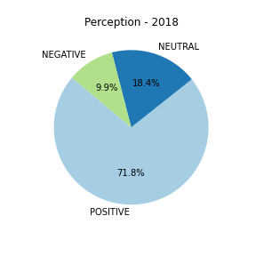
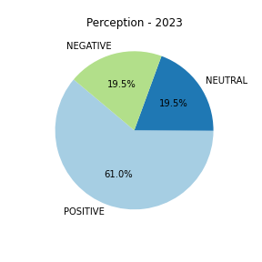

<h3 align="Left">
    
     
</h3>

# The unprecedented shift: Big Tech's turbulent journey from peak hiring to historic layoffs

**Key Findings:**
- Headcount rates don't give much hope for a return to normality in the near future for big tech companies.
- Job postings peaked in 2021, followed by a sharp decline, signaling a conservative hiring approach.
- Perception from big tech employees has significantly shifted compared to 2018 levels.

In the fast-paced world of technology, major industry players like Apple, Amazon, and Netflix continually faced one of their toughest challenges coming out of the pandemic in 2022 and 2023. For the first time in the history of these tech giants, severe measures regarding layoffs and freezing new hirings were taken, shocking the lives of, at the time, current employees and aspiring candidates. 

*How has the performance trend of major tech companies evolved over the years?*

To answer this question, our analysts dived into the behavior of 3 and 12-month moving averages. Moving averages simplify data trends by averaging values over specific periods. The 3-month moving average focuses on short-term fluctuations, providing insights into immediate trends, while the 12-month moving average offers a smoother, longer-term perspective, aiding in identifying more sustained patterns over time.
Our exploration focused on the yearly rates of change of these two indicators. The results show a sustained positive trend from April 2017 to July 2022, around 10% and 15%. However, a rapid decline in July 2022 raised intriguing questions, with the 3-month ROC breaking the negative threshold in July 2023. It is important to note that, even though rates of change show that rapid deceleration period, that only means that the total headcount of these companies was still growing but at a lower rate than before. Compared to the prior year, it is not until we reach the "shrinking" region in July 2023 that headcounts of all these companies experienced an actual reduction. 

*What impact have recent events had on the hiring landscape of major tech players?*

Analyzing job postings from 2020 to 2023 uncovered a significant peak in September and October 2021, with over 400,000 positions available. However, a dramatic decrease ensued, with less than half of the maximum postings within a year. September 2023 witnessed an aggressive decline, suggesting a prolonged conservative hiring approach and anticipating the headcount behavior that can be seen from the previous graph. Following the same trend, the sharp decline in job postings in September 2023 does not provide optimistic signals of a recovery in the near future. 

*How have employees responded to massive layoffs within the tech industry?*

We conducted sentiment analysis using wordmaps to gauge post-massive layoffs opinions in 2023. Negative sentiments included words like management, long, balance, while positive sentiments highlighted expressions such as good work, best, great experience, work-life balance.

    
    

Our analysis also extended to the distribution of business outlook opinions, showing a significant increase in the percentage of employees with a negative perception and a considerable decrease in the percentage of positive ones. We used 2018, a relative good year for big tech companies in operational terms, as a baseline and compared it against 2023. In 2018, the percentage of negative opinions didn't reach 10%, while in 2023, that percentage more than doubled almost reaching the 20%. 

As the tech industry navigates challenges and shifting dynamics, our analysis underscores the need for companies to adapt to evolving trends, ensuring a harmonious balance between growth and employee well-being.

    
    

